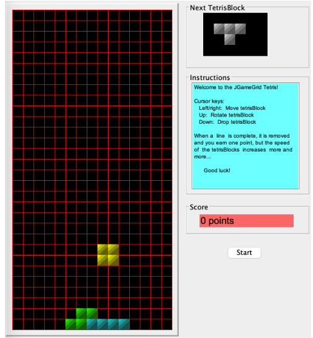
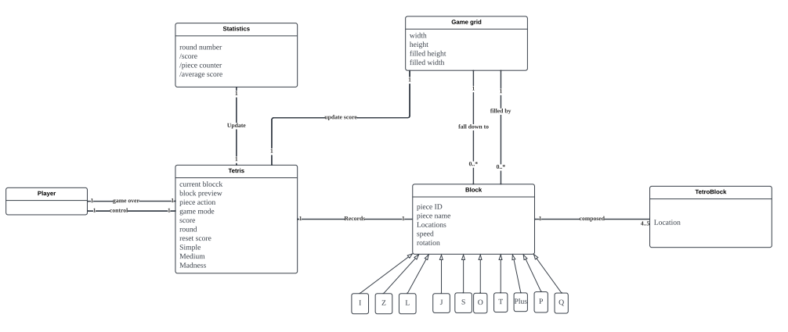

# Tetris Madness 👾

Welcome to Tetris Madness, a classic Tetris game implemented in Java using the JGameGrid library. This README file will guide you through setting up, running, and understanding the project.

## Table of Contents
- [Introduction](#introduction)
- [Features](#features)
- [Architecture](#architecture)
- [Installation](#installation-and-run)
- [Game Controls](#game-controls)
- [Game Mechanics](#game-mechanics)
- [Contribution](#contribution)

## Introduction

The Tetris Madness is a modern take on the classic Tetris game. It is built using the JGameGrid library, which provides a simple and flexible way to create grid-based games in Java. The objective of the game is to clear lines by arranging falling tetrominoes to fill horizontal rows in the game grid.

<div align="center">
  
  <p><i>Title: GUI of Tetris Madness Game</i></p>
</div>

## Features

- Classic Tetris gameplay 🕹️
  
The game randomly selects one of the 7 different Tetris pieces (I, J, L, O, S, T, Z), each made of 4 blocks (TetroBlocks). The selected piece falls down the game grid at a certain speed. While falling, the player can control the piece using keyboard actions. The piece continues to fall until it reaches the bottom of the grid.

- Difficulty Levels 📈

When the difficulty is set to medium, the game introduces three new block shapes (P, Q, and Plus), each consisting of five TetroBlocks. Additionally, the speed of the falling pieces increases by 20% compared to the simple version, with speed still increasing as the score rises. 

On madness difficulty, these three new block shapes are also included, but each piece falls at a random speed within a range from S to 2x S, where S is the speed in the simple version relative to the current score. Furthermore, in madness mode, the rotate function is disabled.

- Record Result 🗒️

In addition to playing a simple game of Tetris, the program updates a statistics file that tracks various metrics. This includes the count of pieces played in the current round, the score achieved in the current round, and the average score per round.

## Architecture
### 1 High Coupling and Low Cohesion in Class Tetris
To decrease high coupling and increase cohesion, two new classes, `MoveBlock` and `BlockCreator`, are introduced.

- #### Delegate Responsibilities to Controller (Class MoveBlock)

Instead of handling basic functions, the functionality related to the movement and controlling of the blocks is separated from the `Tetris` class and delegated to the `MoveBlock` class. The existence of the controller class increases the potential for reuse, which helps achieve low coupling and high cohesion.

- #### Create Pure Fabrication for CreateRandomTetrisBlock (Class BlockCreator)
By creating the `BlockCreator` class, which is an artificial class that does not represent a domain concept, the functionality of generating different types of blocks under various conditions has been implemented. Therefore, the `BlockCreator` class reduces duplication in the `Tetris` class and supports function reuse.

### 2 Polymorphism for Each Shape Class (Abstract Class Block)
 Abstract classes are useful for expanding new requirements when the system needs to modify the business logic. An abstract class `Block` is therefore created to serve as the superclass for each shape class. Every duplicate method from each shape class is extracted to the `Block` class, except for their constructors. This lowers the dependency of each method and makes them easier to understand. The creation of the `Block` class increases cohesion for each shape class, allowing more block shapes to be easily extended.

### 2.5 The Implementation of Protected Variations (Interface Movable)
The `Block` class is unstable due to the possibility of future refactoring. Any method may be modified except for the basic movement methods of the blocks. If code refactoring occurs, it may lead to unpredictable changes in the basic block movement methods. To prevent this, we use interface-segregation principles to decouple the movement method from the `Block` class by creating the `Moveable` interface. The introduction of the interface can decrease the cost and impact of refactoring, allow the function to be easily extended, and decrease coupling as well.
<div align="center">
  
  <p><i>Title: Domain Class diagram of the program</i></p>
</div>

## Installation and Run

### Step 1: Clone the Repository

```sh
git clone https://github.com/Xi3xi/Small-Tetrix-Madness.git
cd Small-Tetrix-Madness.git
```
### Step 2: Run the Game through the .jar file
```sh
java -jar .\Tetrix_Madness.jar
```
The default settings are:
- `isAuto=false`
- `seed=3000`
- `difficulty=easy`
- `logTest=false`
### Step 3: Customize Your Experience
You can run the game with different pre-defined settings (from test1 to test4) by specifying a properties file:
```sh
java -jar .\Tetrix_Madness.jar "test2.properties" 
```
### Step 4: Define Your Own Settings
For a more customized experience, you can define your own settings by modifying or updating the properties files in the properties folder. After making your changes, run the game through the src/Driver class.

## Game Controls

- **Left Arrow**: Move the piece horizontally to the left.
- **Right Arrow**: Move the piece horizontally to the right.
- **Up Arrow**: Rotate the piece 90 degrees clockwise.
- **Down Arrow**: Drop the piece, increasing its falling speed.

## Game Mechanics

- **Clearing Rows**:
    - When a piece falls and results in grid row(s) being filled with TetroBlocks:
        1. The filled row(s) will be cleared.
        2. The TetroBlocks above the cleared row(s) will drop down.
        3. The current score will increase based on the number of rows cleared.

- **Game Over and Restart**:
    - If the game grid becomes vertically full such that a new piece cannot fall:
        1. The game will advise the player that the round is over.
        2. The player can select to begin a new round.
        3. The game grid will be cleared and the score will be reset to 0.
      
## Contribution

We welcome contributions from the community! If you'd like to contribute to Tetris Madness, please follow these steps:

### Special Thanks

We would like to extend our gratitude to the following team members for their valuable contributions to this project:

- **[Hecheng Yin](https://github.com/YomielY?tab=overview&from=2024-07-01&to=2024-07-17)** - Game logic and mechanics
- **Ziyu Pan**    - Testing and debugging

Your hard work and dedication have been instrumental in making Tetris Madness a success. Thank you!

---

Feel free to reach out to us if you have any questions or suggestions for improvement. Together, we can make Tetris Madness even better!